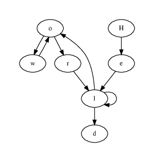

JDotGen is a tiny Java library aiming at facilitating the generation of GraphViz diagrams from Java programs.

This [demo](src/jdotgen/demo/GraphOfLetters.java) will generate the following output:

